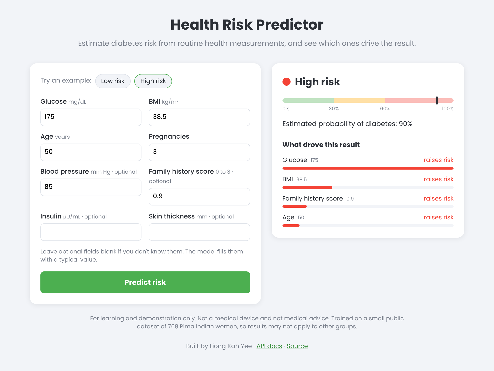

# Health Risk Predictor

A small end-to-end ML app that estimates a person's risk of diabetes from 8 routine health measurements and explains which measurements drove the result. It's a trained scikit-learn model served through a FastAPI REST API, with a simple web page on top.



## The problem

Type 2 diabetes is common and often goes unnoticed for years. A quick screening step that flags people worth sending for a proper blood test could help catch it earlier. This project asks: **given a few standard measurements, how well can a simple model flag who is likely to have diabetes, and can it say why?**

For a screening tool, missing a real case is worse than a false alarm (a false alarm just means an extra test), so I tuned the risk bands to catch as many real cases as reasonable.

## Data

[Pima Indians Diabetes dataset](https://www.kaggle.com/datasets/uciml/pima-indians-diabetes-database), originally from the US National Institute of Diabetes and Digestive and Kidney Diseases. A copy is in `data/`.

- 768 women aged 21+, of Pima Indian heritage. 35% have diabetes.
- Features: pregnancies, glucose, blood pressure, skin thickness, insulin, BMI, a family history score (diabetes pedigree function), age.
- **Data quality issue:** several columns use `0` for "not measured". 374 of 768 insulin values and 227 skin thickness values are 0, and 35 people have a blood pressure of 0, 11 a BMI of 0 and 5 a glucose of 0. These are treated as missing and filled with the training median, rather than fed to the model as real readings.

## Approach

1. Replace impossible zeros with missing values, then fill with the median (`SimpleImputer`).
2. Hold out 20% of patients as a test set, stratified so both sets have the same share of diabetic patients. The test set is only used once, at the end.
3. Compare models with 5-fold cross-validation on the training set:

   | Model | CV ROC AUC |
   |---|---|
   | Logistic regression | 0.843 (± 0.019) |
   | Random forest (300 trees) | 0.834 (± 0.021) |

4. **Pick logistic regression.** It scores as well as the random forest, and it's interpretable: each prediction can be broken down into how much each measurement pushed the risk up or down. For a health use case, being able to explain a result matters.
5. Turn the predicted probability into risk bands: **low** (< 30%), **moderate** (30 to 60%), **high** (60%+).

Training code: [`app/train_model.py`](app/train_model.py). All numbers are saved to [`app/metrics.json`](app/metrics.json).

## Results

Held-out test set (154 patients):

| Version | Flags a patient when | ROC AUC | Accuracy | Precision | Recall |
|---|---|---|---|---|---|
| Original version (random forest, zeros left in) | probability ≥ 50% | 0.81 | 0.76 | 0.68 | 0.59 |
| Current model | probability ≥ 50% | 0.81 | 0.71 | 0.60 | 0.50 |
| **Current model, as used in the app** | **risk is moderate or high (≥ 30%)** | **0.81** | **0.74** | **0.60** | **0.80** |

What this shows:

- **Overall ranking ability (ROC AUC) is the same, about 0.81**, for both versions. This dataset is small and the strongest signal is glucose, so model choice doesn't move the needle much.
- The real gain is in how the model is used. Flagging moderate-or-high risk **catches 80% of diabetic patients, up from 59%** in the original version. The cost is more false alarms (precision 0.60 vs 0.68), which is the right trade for screening.
- The test set is small (154 people), so these numbers can shift by a few points with a different split. The cross-validation scores above are the more stable estimate.

**Biggest drivers** (standardised logistic regression coefficients): glucose (1.18) is by far the strongest, then BMI (0.69), pregnancies (0.38) and family history (0.23). Blood pressure, insulin and skin thickness add almost nothing once glucose and BMI are known.

## How it explains a prediction

For logistic regression, the log-odds of diabetes is a sum of `coefficient × standardised value` for each feature. Each term is that feature's contribution compared with an average patient in the training data: positive raises risk, negative lowers it. The API returns these contributions sorted by size, and the web page shows the top four.

## Run it locally

Needs Python 3.10+.

```bash
git clone https://github.com/kahyeeliong/health-risk-predictor.git
cd health-risk-predictor
python -m venv .venv && source .venv/bin/activate   # Windows: .venv\Scripts\activate
pip install -r requirements.txt

uvicorn app.app:app --reload
```

Open http://127.0.0.1:8000 for the web app, or http://127.0.0.1:8000/docs for interactive API docs (Swagger).

To retrain the model and regenerate the metrics (takes a few seconds):

```bash
python -m app.train_model
```

To run the tests:

```bash
pip install -r requirements-dev.txt
pytest
```

## API

| Method | Path | What it does |
|---|---|---|
| `POST` | `/predict` | Risk band, probability and per-feature explanation |
| `GET` | `/model-info` | Model type, cross-validation and test metrics |
| `GET` | `/health` | Health check |
| `GET` | `/docs` | Swagger UI |

Example request. Blood pressure, skin thickness, insulin and family history score are optional, since most people don't know them offhand.

```bash
curl -X POST http://127.0.0.1:8000/predict \
  -H "Content-Type: application/json" \
  -d '{"Pregnancies": 3, "Glucose": 175, "BloodPressure": 85, "BMI": 38.5, "DiabetesPedigreeFunction": 0.9, "Age": 50}'
```

Response (shortened):

```json
{
  "risk": "high",
  "probability": 0.902,
  "factors": [
    {"feature": "Glucose", "label": "Glucose", "value": 175.0, "effect": "raises", "weight": 2.104},
    {"feature": "BMI", "label": "BMI", "value": 38.5, "effect": "raises", "weight": 0.611},
    {"feature": "DiabetesPedigreeFunction", "label": "Family history score", "value": 0.9, "effect": "raises", "weight": 0.299}
  ]
}
```

Inputs are validated (for example, BMI must be between 10 and 80), and impossible values get a clear `422` error.

## Project structure

```
app/
  app.py            FastAPI service: prediction, explanation, serves the web page
  train_model.py    Data cleaning, model comparison, evaluation, saves the model
  features.py       Feature list and risk band cut-offs shared by both
  model.joblib      Trained model
  metrics.json      Evaluation results
frontend/           Web page (HTML, CSS, vanilla JS)
data/               Pima Indians Diabetes dataset
tests/              API tests (pytest)
render.yaml         Config for deploying to Render
```

## Limitations

- **Not medical advice.** This is a learning project, not a validated clinical tool.
- The dataset is small (768 people) and covers only adult women of one heritage group. The model would need retraining and validation on other populations before its numbers meant anything for them.
- Glucose here is from a 2-hour oral glucose tolerance test, not a casual finger-prick reading.
- Filling missing insulin and skin thickness with the median is simple. Better imputation (or dropping those features) is worth testing.

## Next steps

- Calibrate the probabilities and check calibration on the test set.
- Try gradient boosting and SHAP explanations, and compare with the logistic regression baseline.
- Deploy a public demo (Render config is included).

## About

Built by Liong Kah Yee to learn the full path from a dataset to a working ML product: data cleaning, model selection, honest evaluation, serving a model through an API, and a usable front end. The idea was inspired by another creator's project; this version is built from scratch.
